# Developer Guide
* [Introduction](#1-introduction)
    * [Purpose](#11-purpose)
    * [Target Audience](#12-target-audience)
    * [Description](#13-description)
* [Design](#2-design)
    * [Architecture](#21-architecture)
    * [UI](#22-ui)
    * [Task Component](#23-task-component)
    * [Storage Component](#24-storage-component)
    * [calendar Component](#25-calendar-component)
* [Implementation](#3-implementation)
    * [List By Category](#31-list-by-category)
    * [Calendar](#32-calendar-command)
    * [Add](#33-proposed-add-task--class)
    * [Storage](#34-storage)
* [Documentation](#4-documentation)
* [Testing](#5-testing)
* [Dev Ops](#6-dev-ops)
  * [Appendix A: Product Scope](#61-appendix-aproduct-scope)
  * [Appendix B:Value proposition](#62-appendix-bvalue-proposition)
  * [Appendix C:User Stories](#63-appendix-cuser-stories)
  * [Appendix D:Non-Functional Requirements](#64-appendix-dnon-functional-requirements)
  * [Appendix E:Instructions for Manual Testing](#65-appendix-einstructions-for-manual-testing)
  
## 1. Introduction

### 1.1. Purpose
This Developer's guide is meant to guide future developers of the project on how CAFS was developed. 
It will include the design and implementations of CAFS to give a better understanding of how to start the development of the program

### 1.2. Target Audience
The target audience of this guide are:
* Developers (Current / Future)
* Testers
* Users interested in the operations of the program

### 1.3. Description
CAFS - va CLI calender-like task scheduler that supports task and 
class schedule adding. It is simple to use, and comes with an auto-save function to 
remember your tasks.

### 1.4. Setting up
 
#### 1.4.1. Prerequisites
1. Ensure you have Java 11 or above installed in your Computer

1. IntelliJ IDE
>IntelliJ by default has Gradle plugins installed.
>Do not disable them. If you have disabled them, go to File > Settings > Plugins to re-enable them.

#### 1.4.2. Setting up the project in your computer
1. Fork this repo, and clone the fork to you computer

1. Open `IntelliJ` (if you are not in the welcome screen, click `File` > `Close Project` to close the existing project dialog first)

1. Set up the correct JDK version for Gradle

    * Click `Configure` > `Project Defaults` > `Project Structure`

    * Click `New…`​ and find the directory of the JDK

1. Click `ImportProject`

1. Locate the `build.gradle` file and select it. Click OK

1. Click `Open as Project`

1. Click `OK` to accept the default setting. 

#### 1.4.3. Verifying the setup
1. Run the `seedu.cafs.Main ` and try a few commands.

1. [Run the tests](#5-testing) to ensure they are all set up.
 

## 2. Design
### 2.1. Architecture

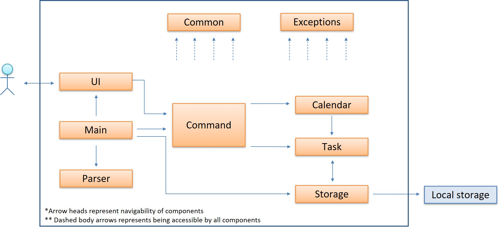

Below, we will describe the essential components that CAFS uses:

1. Main - Main component which controls the flow of execution.
1. UI - Component used for user interactions, reading in input and displaying to console
1. Parser - Component used to interpret user input and call the corresponding command
1. Command - Contains all the required implementation for the different commands
1. Storage - Reads data from, and writes date to, the hard disk
1. Exceptions - Component contains custom error handling methods for the program used by multiple other components
1. Calendar - Component containing methods to interact with date and generating a calendar
1. Task - Contains all the necessary information and implementations required to interact with the list of tasks
1. Commons - Component represents a collection of classes used by multiple other components

### 2.2. UI
* The UI component is not navigable from Command because all results from commands are passed back to main, in the form of `CommandResult`
* UI component then takes in the CommandResult object and displays the feedback from the inputted command

Here is a simplified class diagram to illustrate this interaction:

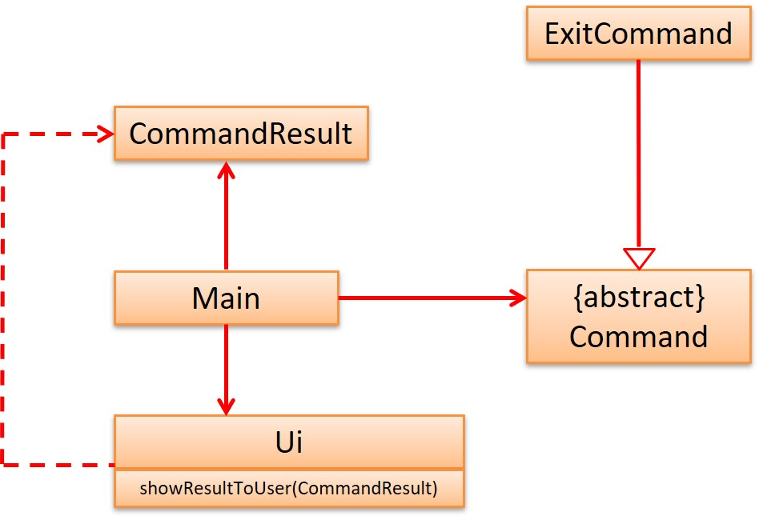

Ideally, all messages or output meant to be displayed should use the UI class instead of calling a system print or any other method.

* At the moment, the only outliers are certain exception error handling messages which will be standardised to follow this principle in a later version.

### 2.3. Task Component

The TaskList Component depends on 2 other components:
1. Storage 
    * The Storage component is responsible for loading in any saved data stored locally, as well as updating the saved file 
    when changes to the task list have been made
    
2. Command 
    * The Command component executes the specific set of instructions required to fulfill a particular user command
    based on user input.

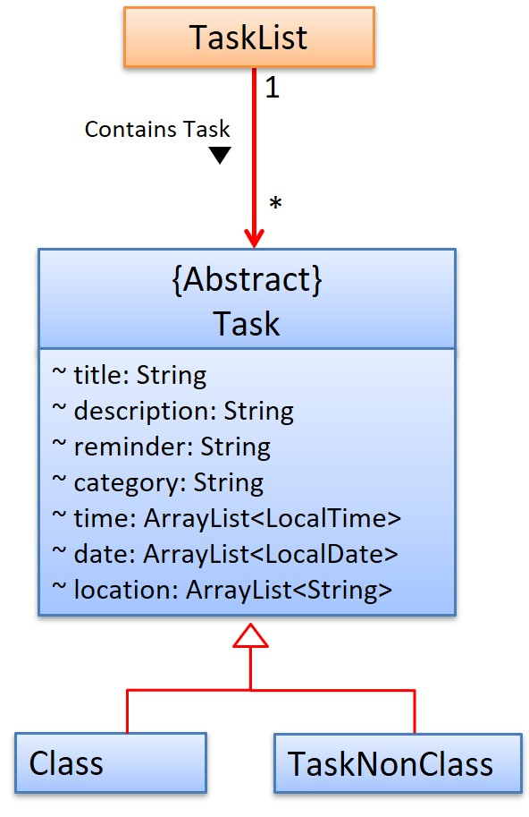

The abstract class Task comprises of two subclasses:
* Class - to contain information about a class / timetable schedule
* TaskNonClass -  to contain information about all other tasks that user needs to complete or be reminded of

In total, Task component comprises of 4 classes:
1. TaskList - Methods called by commands to operate on task list. Also contains the actual list which stores all tasks.
1. Task - Abstract class to model a generic task
1. Class - Specialised class to model a student's timetable
1. TaskNonClass - Specialised class to model an actionable task / todo

### 2.4. Storage Component 

The Storage component consists of a single class that parses `Task` instances to Json strings using an external library, Gson by Google.  
This component,
* can load from a text file Json strings and parse them to `Task` instances 
* can parse `Task` instances to Json strings and save them in a text file

Below is a class diagram showing the interactions of this component with other classes.

### 2.5. Calendar Component

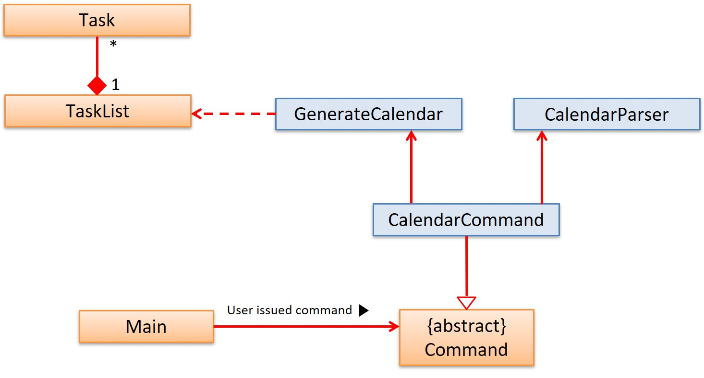

The Calendar component consists of 2 classes:
1. CalendarParser - returns back all the necessary information about the requested month (eg. starting day, how many days/weeks in month)
1. GenerateCalendar - formats the requested month and daily data into a monthy calendar

The Calendar component depends on one other component:

1. Task - Calendar component queries the Task component to determine how many tasks there are for each day of the selected month

For future development, any code that requires the parsing of LocalDate can use the CalendarParser class to retrieve information of that date.

## 3. Implementation

#### 3.1 List By Category
##### 3.1.1 Implementations
The list by category mechanism is facilitated by ListCommand which extends Command.

Given below is an example usage scenario and how the mechanism behaves at each step.

Step1: The user adds a task:  `add n/2113 c/DEADLINE d/2020-03-30 t/11:59` to add a task.
Since the user adds a new category `DEADLINE`, the categoryMap wil add one more key whose value is the category and the value is
the index for this task.

Step2: The users adds a task: `add n/3145 c/CLASS` to add a class. 
Since the user adds a new category `CLASS`, the categoryMap wil add one more key whose value is the category and the value is
the index for this task.

Step3: Users list the class he just added by category CLASS: `list c/CLASS`. The TaskList will
return the index of the tasks based on the categoryMap. Then the task in the `CLASS` category
will be displayed. 

This is the Sequence Diagram for list by category. 
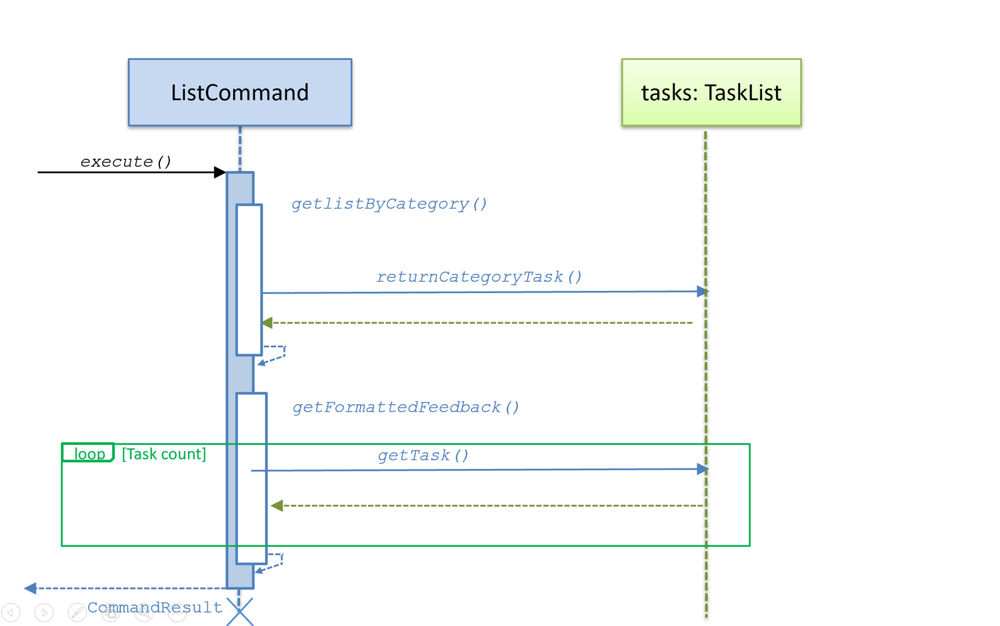

This is the UML design for list by category.

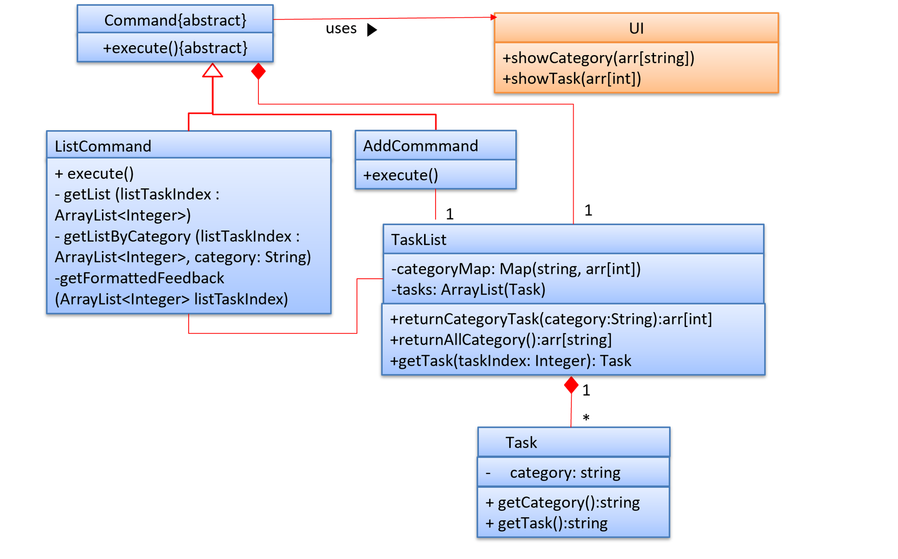

##### 3.1.2 Design Considerations
Aspect: How to find certain category. 

Alternative 1 (previous choice): store HashMap to map category with the key. The map still exists which
stores the needed categories. 

Alternative 2 (current choice): linear search when searching tasks. 

#### 3.2 Calendar Command
##### 3.2.1 Implementation
The monthy view mechanism is facilitated by CalendarCommand which extends Command.

Given below is an example usage scenario and how the mechanism behaves at each step.

1. The user inputs the command word `calendar`. Upon which, the instance of parser will return a CalendarCommand for execution
    * There is an optional argument that the user can input to select which month to display
    * All invalid months will be redirected to display current month
        * This is a design choice, and can be changed to display an error if users find it misleading
    
1. CalendarCommand initialises with the following variables, with the help from CalendarParser class containing the necessary methods related to day/date.
    * checkMonth - if user does not input month, it uses computer's current month
    * startingDay - which day of the week the first day of the months begins on (0-6, where 0 is Monday)
    * totalDays - how many days in that month
    * totalWeeks - number of weeks of the month
    * currentYear - the current year. The application currently does not support different years.
    
1. CalendarCommand creates a new class GenerateCalendar with the information initialised above to generate an output of the selected month. 
1. The GenerateCalendar calls on TaskList#categoryCounter() for each day of the month to generate the task listing for a particular day.
1. The calendar generated is then returned to CalendarCommand as a string and stored in CommandResult where it is displayed Main.

The class diagram below shows the relationships between the different classes required by the `calendar` feature.
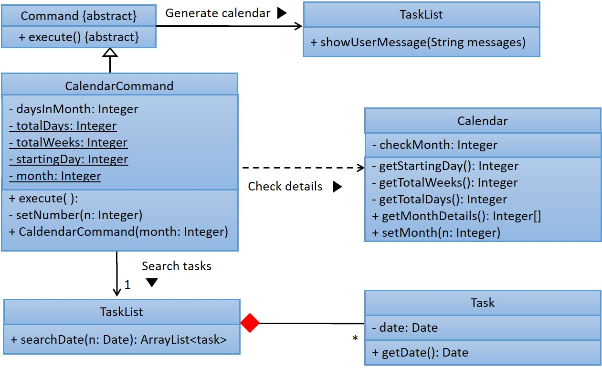

The following diagram summarises what happens when a user executes a new `calendar` command:
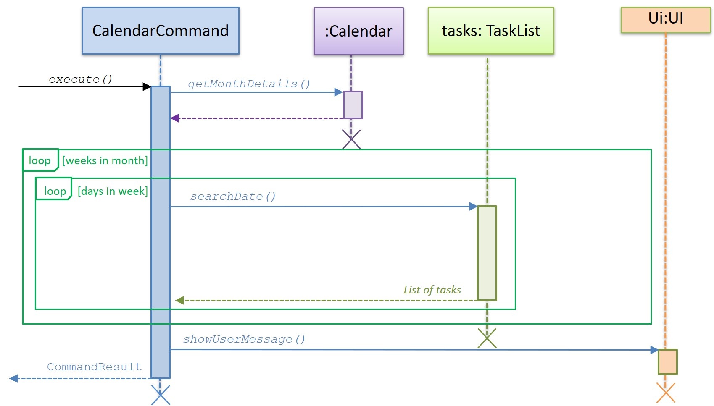

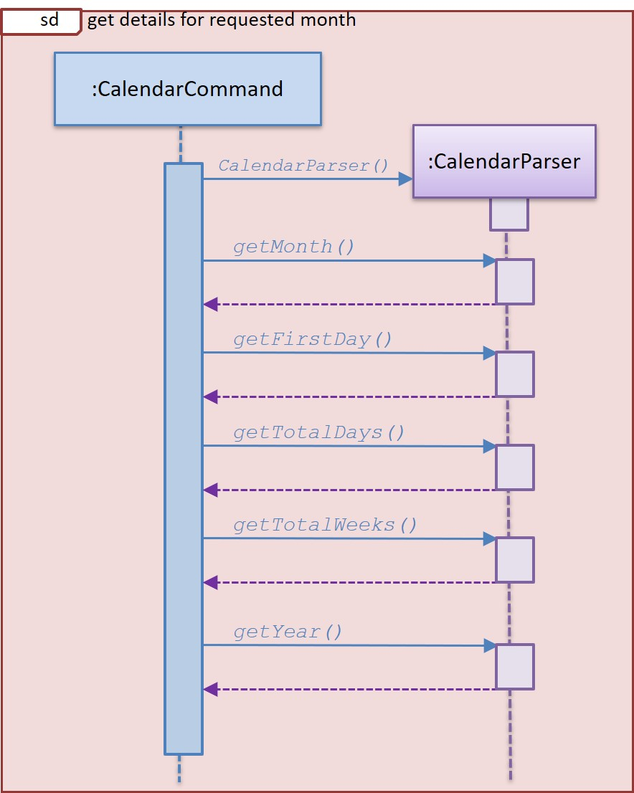

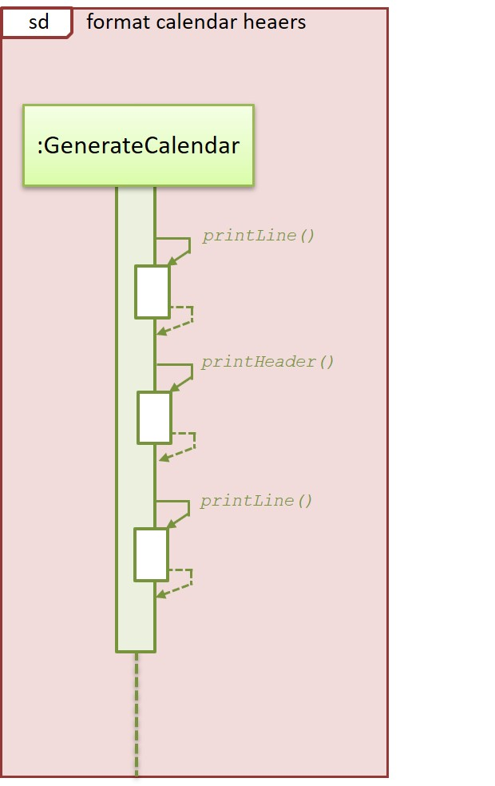

##### 3.2.2 Design Considerations
1. Aspect: Obtaining information required for generating monthly view
  
    * Alternative 1: Algorithm to deduce how many weeks in month, which day a date is, how many days in that month
        * Pros: Will use less memory, requiring only one starting date we are able to derive any other dates. No need to worry about changing template for the new year
        * Cons: New developers will take additional effort to understand how the algorithm works.
      
    * Alternative 2: Hardcoded information (constant variables to tell days in month/how many weeks)
        * Pros: Easy maintenance, tedious but easily calculated with web applications.
        * Cons: Tedious and not sustainable, constant updates have to be done to edit the fields for a new year
    
    * Alternative 3 (current): Make use of Java inbuilt features to parse date by using Calendar and LocalDate.
        * Pros: Easy maintenance, errors handled internally. A lot of methods to manipulate data.
        * Cons: Might be hard to understand how to use at first
     
1. Aspect: Which month to use
  
    * User might want to know schedule for other months, but might also want a quick view of current month
    * Solution is to set a default month (taken from computer) and also allow input for preferred month.
    
#### 3.3 [Proposed] Add Task / Class
##### 3.3.1 Proposed Implementation
The add `task/class` mechanism is facilitated by AddCommand which extends Command.

Given below is an example usage scenario and how the mechanism behaves at each step.

1. The user inputs a correct command format:  `add n/title`.\
   Upon which, the instance of parser will return a AddCommand for execution. 
   
1. The base Command initialises with the following variables
    * taskList - manages the tasks
    * storage - updates the storage
    * ui - enable ui communication (which is not used in this command)
    
1. During the execution procedure:
    * It calls the functions in the Command which can get the fields of all the input.
    * It will then check the date/time format to see if input matches format standard.
    * If the inputs are in correct format: will add a task/class by calling the `addTask` of the _taskList_
    * Then it will call the `getList` and pass current List into storage for update
    * The newly added tasks and current taskList information will be stored in a string and pass to CommandResult. 

The class diagram below shows the relationships between the different classes required by the `calendar` feature.
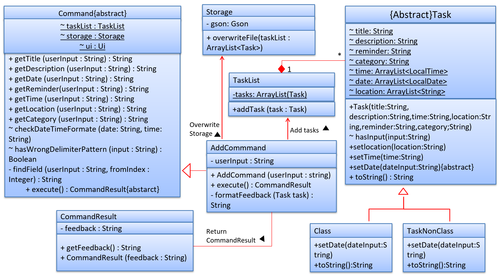

The following diagram summarises what happens when a user executes a new `calendar` command:
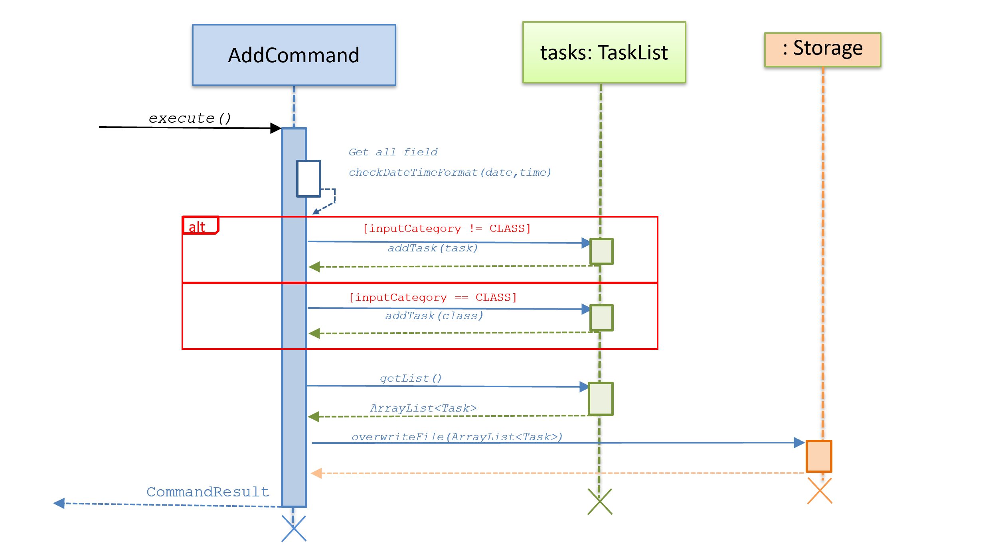

##### 3.3.2 Design Considerations
1. Distinguish between `class` and `task`
    * By checking the input category information:
     If the category is `class`, then will add a **Class**, else will add a **Task**

1. Processing of Date,Time Format
    * Alternative 1(current): The AddCommand will check only check the basic format of input(e.g. time should be
    a range and date should not contain `/`), and then the Task class do the processing
        * Pros: The **Task** will only focus on the DataTimeFormat error and some small time range errors.
        The passing of variables is also convenient. 
        * Cons: **Task** May also need to deal with error handling. This may not be very easy to deal with. 
    
    * Alternative 2: The AddCommand will not only check the format but also check if the input is in correct
    DateTimeFormat.
        * Pros: It ensures the correctness of adding tasks, so no more error handling in **Task**.
        * Cons: May need to adjust the passing variables, and the AddCommand is dealing with 
        too much things which violates the design idea of OOP. 
    
##### 3.3.3 Future Enhancement
1. Enable `class` to store semester information so that date of class can be displayed in date format.
2. Enable repetition of `task`: e.g. Once a week, twice a week. 

#### 3.4. Storage
##### 3.4.1 Proposed Implementation
The Storage mechanism is facilitated through the Gson library implemented by Google. Tasks
are loaded from the `Main` class and saved from the  `done`, `edit`, `add`, and `delete` commands.

The interaction is similar for all the commands. Below is a sequence diagram showing the interactions between classes when a task is added to the list:
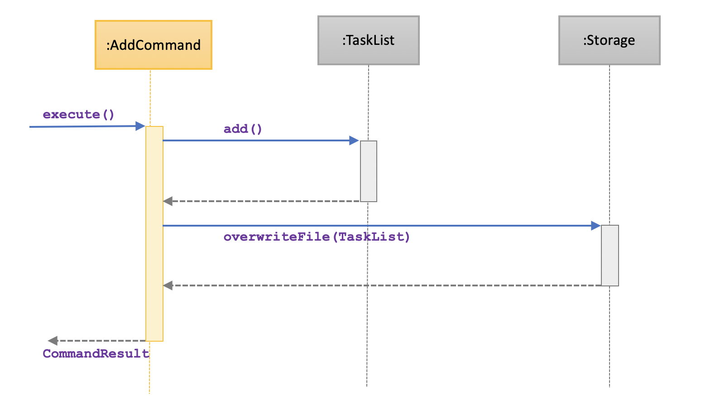

1. The user inputs the `add` command. After being parsed, the command is executed.
1. The `add` command adds a `Task` instance to the `taskList`.
1. After successful addition of the task, the `add` command calls the Storage#overwriteFile() to 
overwrite all the current tasks from the `taskList` to the external `data.txt` file.

##### 3.4.2 Design Considerations
1. Aspect: Saving tasks
* Alternative 1:(current choice) Overwrite all tasks in the `taskList` to the `data.txt` file when a task is edited, added, done, or deleted.  
  * Pros: Less code and easier to maintain and implement
  * Cons: Redoing work that has been done before, thus wasting resources
* Alternative 2: Save only the specific tasks that is being edited, added, done, or deleted.
  * Pros: Saves resources since it only changes one task
  * Cons: Difficult and tedious to implement since Json strings are being kept in a text file. For example, it would be hard
  to know which specific class was edited or deleted from the text file.
    
1. Aspect: How to save tasks
  * Alternative 1:(current choice) Save tasks individually as Json strings in the text file. Json strings
  are separated by new lines in the file. When loading tasks, check whether they are instances of 
  `TaskNonClass` or `Class`.
    * Pros: Avoid overflow of a single Java String since we can have many tasks in the list at a given time
    * Cons: Tedious to keep track of in the external text file
  * Alternative 2: Save the whole `taskList` as a Json string in the external text file.
    * Pros: Easy to implement both overwriting and loadings tasks from the text file.
    * Cons: May overflow a Java String faster if there are many tasks in the list at a given time.
    

## 4. Documentation

## 5. Testing
### 5.1 Running Tests
We adopt the JUnit test: Using IntelliJ JUnit test runner
To run all tests, right-click on the src/test/java folder and choose Run `Tests in <foldername>.test`
To run a subset of tests, you can right-click on a test package, test class, or a test and choose Run  `TestName`

### Types of Tests
We have two types of tests:
1. Unit tests targeting the lowest level methods/classes:
e.g. `seedu.tasklist.TaskListTest`

2. Integration tests that are checking the integration of multiple code units (those code units 
are assumed to be working).
e.g. `seedu.command.AddCommandTest`

## 6. Dev Ops
### 6.1 Appendix A:Product Scope
Target User profile:
1. University students.
2. Prefer desktop apps.
3. Can type fast

### 6.2 Appendix B:Value proposition
It solves:
1. Daily tasks arrangement
2. Class schedule arrangement
3. Event alert

### 6.3 Appendix C:User Stories

|Version| As a ... | I want to ... | So that I can ...|
|--------|----------|---------------|------------------|
|v1.0|No 1. is any type of student [epic] (3)   | add events to my calendar | I know what I have to do in the upcoming weeks |
|v1.0|                                          | add the location where events take place | I know where I have to go |
|v1.0|                                          | add club, research, project, or other meetings | Be reminded of my activities |
|v1.0|No 2. is a university student | delete specific events from my calendar | I don't get reminded about events that already happened |
|v1.0|No 3. is a university student | can move events from one day to another | Will not need to  retype all the event details again |
|v1.0|No 5. is a university student | add descriptions to events | to remind myself what the event was about |
|v2.0| No 4. is a university student | see multiple calendar views (day, week, month) | I can get different perspectives of what my schedule looks like |
|v2.0| No 9. is a university student | export my calendar as a text file | I can print it to have a physical copy |
|v2.0| No 10. is a university student | remove all the events that happened in a specific date range | it's easy to delete unnecessary details from my calendar |
|v2.0| No 11. is a university student | add my student schedule | quickly reference it when I forget my next class |
|v2.0| No 12. is a university student | edit my student schedule | Edit the schedule which I may input wrongly |
|v2.0| No 13. is a university student | edit my task | Edit the task which I may input wrongly |
|v2.0| No. 23 is a university student | list events by category | I can easily find exactly the events I need to see |
|v2.1| No. 6 is a student who cares about friendship | add tokens to specific days in my calendar | I can remember special occasions such as birthdays, religious events, etc. |
|v2.1| No. 21 is a university student | list events by date | I can easily find exactly the events I need to see by date |
|v2.1| No. 24 is a university student who want to check whether a designated time has events | list events by time | I can easily find exactly the events I need to see by time |
|v2.1| No. 25 is a university student who want to check whether a designated time has classes | list events by time and category | I can easily find exactly the classes I need to see by time and category |
|v2.1| No. 22 is a university student who has some emergency and want to cancel the events in a specific date | delete events by date | I can easily delete exactly the events I need to see by date |
|v2.1| No. 26 is a male student who want to quit events in a designated time cause he has a remote date with his remote girlfriends in that time everday! | delete events by time | I can easily find exactly the events I need to see by time |
|v2.1| No. 27 is a university student who want to delete its todo category's events cause it does not want to work hard anymore that day | delete events by time and category | I can easily find exactly the events I need to see by date and category |
|v2.1| No. 28 is a university student who has a emergency in specific time and date. He wants to delete that time's work | Delete events by date and time | I can easily find exactly the events I need to see by date and time |

### 6.4 Appendix D:Non-Functional Requirements

1. Should work in an environment without internet access.
1. Should offer easy / experienced user input modes to accommodate to different proficiencies
1. Data should be persistent across different start-ups
1. Not too restrictive on user to avoid frustrations (user friendly)

### 6.5 Appendix E:Instructions for Manual Testing

#### 6.5.1 Launch and Shutdown
1.  Initial launch

* Ensure you have Java 11 or above installed in your Computer
* Download the latest cafs.jar [here](https://github.com/AY1920S2-CS2113-T14-3/tp/releases)
* Copy the file to the folder you want to use as the home folder.
* Run the jar file using `java - jar caf.jar`

> Expected: Shows a welcome message from CAFS

2. Shutdown

* Enter the command `bye` to exit the CAFS
* Close the command terminal.

> Expected: Data is stored in the `data.txt`

#### 6.5.2 Add Task/Class
1. Add a Task
    * Test case 1: 
        * `add n/Project Meeting t/12:00-13:00 15:00-16:00 d/2020-07-01 2020-09-01 l/NUS NTU c/meeting`
        > Expected:  
        Nice! Added the following task to the calendar:                                                                                            
        [MEETING] Title: Project Meeting | 2020-07-01 : 12:00 - 13:00 ( NUS ) | 2020-09-01 : 15:00 - 16:00 ( NTU ) 
        Now you have <NUM> task/tasks in your list

    * Test case 2:
        * `add n/2113 v2.1 t/23:00-24:00 d/2020-05-16 c/deadline`
        > Expected: 
         Nice! Added the following task to the calendar:                                                                                            
          [DEADLINE] Title: 2113 v2.1 | 2020-05-16 : 23:00 - 23:59 
         Now you have <NUM> task/tasks in your list
2. Add a Class
    * Test case 1:
        * `add t/11:00-12:00 01:00-03:00 n/2113 d/3 4 c/CLASS l/COM2 COM1`
        > Expected:  
        Nice! Added the following task to the calendar:                                                                                            
        [CLASS] Title: 2113 | WEDNESDAY : 11:00 - 12:00 ( COM2 ) | THURSDAY : 01:00 - 03:00 ( COM1 ) 
        Now you have <NUM> task/tasks in your list

    * Test case 2:
        * `add n/3245 t/17:00-19:00 d/5 c/CLASS`
        > Expected: 
         Nice! Added the following task to the calendar:                                                                                        
         [CLASS] Title: 3245 | FRIDAY : 17:00 - 19:00 
         Now you have <NUM> task/tasks in your list

#### 6.5.3 Edit Task/Class
_Assumption: Valid index is provided. This test output is based on previous added task in the_ [Add Task/Class](#652-add-taskclass)
1. Edit a Task
    * Test case 1:
        * `edit 2 l/NUSCOM2 r/Finish soon`
        > Expected: 
         Task 2 edited 
         [DEADLINE] Title: 2113 v2.1 | Reminder: Finish soon | 2020-05-16 : 23:00 - 23:59 ( NUSCOM2 )
    
    * Test case 2:
        * `edit 1 d/2020-09-10 t/12:00-13:00 l/NUS`
        > Expected: 
         Task 2 edited 
         [MEETING] Title: Project Meeting | 2020-09-10 : 12:00 - 13:00 ( NUS )

2. Edit a Class
    * Test case:
    * _Previous index 4 is a class.Also, previously this index 4 class has only one time slots_
        * `edit 4 d/1`
        > Expected:  
        Task 1 edited 
        [CLASS] Title: 3245 | MONDAY : 17:00 - 19:00

#### 6.5.4 Done Task
* _Assumption: Valid index is provided. This test output is based on previous added task in the_ [Add Task/Class](#652-add-taskclass)
    * Test case:
        * `done 1`
        > Expected: 
        Task marked as done:  
        [Y] [MEETING] Title: Project Meeting | 2020-07-01 : 12:00 - 13:00 ( NUS ) | 2020-09-01 : 15:00 - 16:00 ( NTU )

#### 6.5.5 List Task
* _Assumption: This test output is based on previous added task in the_ [Add Task/Class](#652-add-taskclass)
    * Test case 1:
        * `list`
        > Expected: all inputted valid tasks + class
    
    * Test case 2:
        * `list c/class`
        > Expected: list all tasks whose category is CLASS

    * Test case 3:
        * `list d/2020-05-16` 
        > Expected: Lists the tasks that fall on 2020-05-16

    * Test case 4:
        * `list d/2020-05-16 t/23:00-23:59`
        > Expected: Lists the tasks that fall on 2020-05-16 and within the time range 23:00-23:59

    * Test case 5:
        * `list d/2020-05-16 t/23:00-23:59 c/deadline`
        > Expected: Lists the tasks that fall on 2020-05-16 and within the time range 23:00-23:59 and whose category is DEADLINE

#### 6.5.6 Delete Task
* _Assumption: Valid index is provided. This test output is based on previous added task in the_ [Add Task/Class](#652-add-taskclass)
    * Test case 1: 
        * `delete 3`
        > Expected: 
         The following task has been removed:                                                                                           
         [CLASS] Title: 2113 | WEDNESDAY : 11:00 - 12:00 ( COM2 ) | THURSDAY : 01:00 - 03:00 ( COM1 ) 
         Now you have <NUM> task/tasks in your calendar.

    * Test case 2: 
         * `delete d/2020-05-16`
         > Expected: 
           The following task has been removed:                                                                                           
           [DEADLINE] Title: 2113 v2.1 | 2020-05-16 : 23:00 - 23:59 
           Now you have <NUM> task/tasks in your calendar.

    * Test case 3: 
         * `delete t/14:00-16:00`
         > Expected: 
           The following task has been removed:                                                                                           
           [MEETING] Title: Project Meeting | 2020-07-01 : 12:00 - 13:00 ( NUS ) | 2020-09-01 : 15:00 - 16:00 ( NTU ) 
           Now you have <NUM> task/tasks in your calendar.
                                  
#### 6.5.7 Find
* _Assumption: This test output is based on previous added task in the_ [Add Task/Class](#652-add-taskclass) 
    * Test case:
        * `find nus`
        > Expected: 
        Found the followings tasks: 
        1.[MEETING] Title: Project Meeting | 2020-07-01 : 12:00 - 13:00 ( NUS ) | 2020-09-01 : 15:00 - 16:00 ( NTU )
        

#### 6.5.8 Calendar
* Test case:
     * `calendar`
     > Expected: current month calendar will be displayed. 
     The tasks on that month will also be displayed.

#### 6.5.9 Clear
* Test case:
     * `clc`
     > Expected: Clears the output window.
        
#### 6.5.10 Help
* Test case:
    * `help`
    > Expected: The usage of command will be displayed. 
 