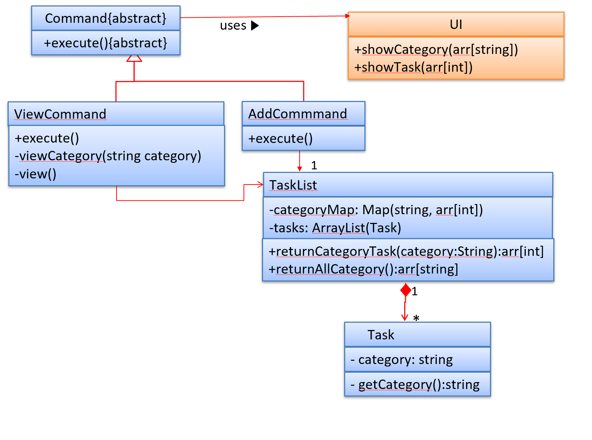

# Developer Guide
* [Setting up](#1-setting-up)
* [Design](#2-design)
* [Implementation](#3-implementation)
  * [Undo features](#31-proposed-undo-feature)
    * [View By Category](#311-view-by-category)
* [Documentation](#4-documentation)
* [Testing](#5-testing)
* [Dev Ops](#6-dev-ops)
  * [Appendix A: Product Scope](#61-appendix-aproduct-scope)
  * [Appendix B:Value proposition](#62-appendix-bvalue-proposition)
  * [Appendix C:User Stories](#63-appendix-cuser-stories)
  * [Appendix D:Non-Functional Requirements](#64-appendix-dnon-functional-requirements)
  * [Appendix E:Glossary](#65-appendix-eglossary)
  * [Appendix F:Instructions for Manual Testing](#66-appendix-finstructions-for-manual-testing)
## 1. Setting up
## 2. Design

{Describe the design of the product. Use **Architecture Diagram** which has not been covered yet.}

## 3. Implementation
### 3.1 [Proposed] Features
#### 3.1.1 List By Category
It extends the current view command.
The user can use `list` to view all tasks.
The user can also use `list CATEGORY` to view specific classes whose category is sth. 
This is the UML design for view by category.

Step1: Users add task and add either a default category/new category.
If user adds default category, then the categoryMap in taskList will not be modified.
If the user adds a new category, the categoryMap wil add one more key whose value is the category and the value is
the index for this task.

Step2:  User view tasks by category.
If user only type in `list`, then all tasks will be displayed according to the sequence of task
index. It simply calls the view function.
If user type in in `list CATEGORY`, and the category is valid, then it will go for the
returnCategory method.
If user type in in `list CATEGORY`, and the category is invalid, then it will go for the
displayCategory method. 
Whatever the path, the UI will finally be called either display tasks given the index or display
category. 

#### 3.1.2 [Proposed] View month
##### 3.1.2.1 Proposed Implementation
The view month mechanism is facilitated by CalendarCommand which extends Command.

Given below is an example usage scenario and how the mechanism behaves at each step.

1. The user inputs the command word `calendar`. Upon which, the instance of parser will return a CalendarCommand for execution
1. CalendarCommand initialises with the following variables, with the help from a calendar class containing the necessary methods related to day/date.
    * currentMonth - if user does not input month, it uses computer's current month
    * startingDay - which day of the week the first day of the months begins on (0-6, where 0 is Monday)
    * totalDays - how many days in that month
    * weekCount - number of weeks of the month
1. The `calendar` command calls on TaskList#findTaskDate() for each day of the month to generate the task listing for a particular day. Only the task event and description is added to calendar view. 
1. The calendar generated is then stored in a string and UI#showUserMesssage() is called to display the calendar. 

The following diagram summarises what happens when a user executes a new `calendar` command:

##### 3.1.2.2 Design Considerations
1. Aspect: How calendar executes
    * Alternative 1 (current choice):
    * Alternative 2:
1. Aspect: Obtaining information required for generating monthly view
    * Alternative 1: (current choice) Algorithm to deduce how many weeks in month, which day a date is, how many days in that month
        * Pros: Will use less memory, requiring only one starting date we are able to derive any other dates. No need to worry about changing template for the new year
        * Cons: New developers will take additional effort to understand how the algorithm works.
    * Alternative 2: Hardcoded information (constant variables to tell days in month/how many weeks)
        * Pros: Easy maintenance, tedious but easily calculated with web applications.
        * Cons: Tedious and not sustainable, constant updates have to be done to edit the fields for a new year
1. Aspect: Which month to use
    * User might want to know schedule for other months, but might also want a quick view of current month
    * Solution is to set a default month (taken from computer) and also allow input for preferred month.
    
## 4. Documentation

## 5. Testing
There are two ways to do the test.
Method 1: Using IntelliJ JUnit test runner
To run all tests, right-click on the src/test/java folder and choose Run `All Tests`
To run a subset of tests, you can right-click on a test package, test class, or a test and choose Run  `ABC`

Method 2: Using Gradle
Open a console and run the command gradlew clean test (Mac/Linux: ./gradlew clean test)
## 6. Dev Ops
### 6.1 Appendix A:Product Scope
Target User profile:
1. University students.
2. Prefer desktop apps.
3. Can type fast

### 6.2 Appendix B:Value proposition
It solves:
1. Daily tasks arrangement
2. Class schedule arrangement
3. Event alert

## 6.3 Appendix C:User Stories

|Version| As a ... | I want to ... | So that I can ...|
|--------|----------|---------------|------------------|
|v1.0|No 1. is any type of student [epic] (3)   | add events to my calendar | I know what I have to do in the upcoming weeks |
|v1.0|                                          | add the location where events take place | I know where I have to go |
|v1.0|                                          | add club, research, project, or other meetings | Be reminded of my activities |
|v1.0|No 2. is a university student | delete specific events from my calendar | I don't get reminded about events that already happened |
|v1.0|No 3. is a university student | can move events from one day to another | Will not need to  retype all the event details again |
|v1.0|No 5. is a university student | add descriptions to events | to remind myself what the event was about | 
|v2.0| No 4. is a university student | see multiple calendar views (day, week, month) | I can get different perspectives of what my schedule looks like |
|v2.0| No. 6 is a student who cares about friendship | add tokens to specific days in my calendar | I can remember special occasions such as birthdays, religious events, etc. |
|v2.0| No 9. is a university student | export my calendar as a text file | I can print it to have a physical copy |
|v2.0| No 10. is a university student | remove all the events that happened in a specific date range | it's easy to delete unnecessary details from my calendar |
|v2.0| No 11. is a university student | add my student schedule | quickly reference it when I forget my next class |
|v2.0| No. 20 is a university student who has frequent project meetings in school | compare my schedule with team mates easily | we can quickly find a common time to work |
|v2.0| No. 23 is a university student | list events by category | I can easily find exactly the events I need to see |
|v2.0| No. 24 is a university student | list events by date | I can easily find exactly the events I need to see |

## 6.4 Appendix D:Non-Functional Requirements

1. Should work in an environment without internet access.
1. Should offer easy / experienced user input modes to accommodate to different proficiencies
1. Data should be persistent across different start-ups
1. Not too restrictive on user to avoid frustrations (user friendly)

## 6.5 Appendix E:Glossary

* *glossary item* - Definition

## 6.6 Appendix F:Instructions for Manual Testing

{Give instructions on how to do a manual product testing e.g., how to load sample data to be used for testing}
