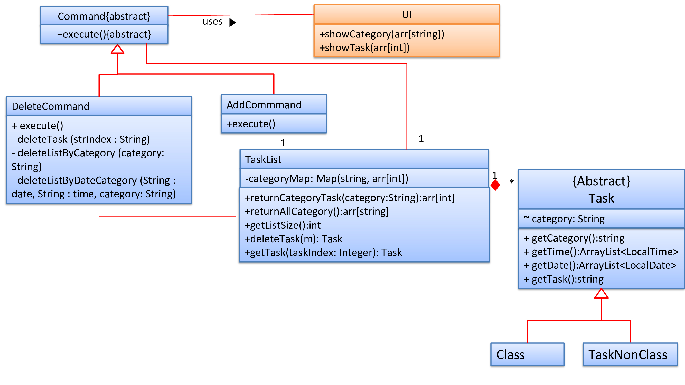

# Li Yuchen - Project Portfolio

## PROJECT: [CAFS](https://github.com/AY1920S2-CS2113-T14-3/tp/)

## Overview

* [1. CAFS Introduction](#introduction)

* [2. Summary of Contributions](#summary-contribution)
+ [2.1 Code contribution](#code-contribution)
  + [2.2 Enhancements implemented](#enhancement-implemented)
  + [2.3 Contributions to documentation](#contribute-documentation)
  + [2.4 Contributions to the Developer Guide](#contribute-developerguide)
  + [2.5 Contributions to team-based tasks](#contribute-team)
  + [2.6 Review/Mentoring contributions](#review-mentoring)
  + [2.7 Contributions beyond the project team](#contribute-team)
  
* [3. Contributions to the User Guide](#contribute-ug)

* [4. Contributions to the Developer Guide](#contribute-dg)

* [5. About me](#about-me)

### CAFS Introduction 

Va CLI calender-like task scheduler that supports task and class schedule adding. It is simple to use, and comes with a save function to remember your tasks. The user interacts with the application using a CLI. The project is mainly written in Java.

### Summary of contributions

#### Code contribution

You can view my code contribution for this project: [RepoSense Dashboard](https://nus-cs2113-ay1920s2.github.io/tp-dashboard/#breakdown=true&search=yuchenlichuck&sort=groupTitle&sortWithin=title&since=2020-03-01&timeframe=commit&mergegroup=false&groupSelect=groupByRepos)

#### Enhancements implemented

- Major Enhancement: added the ability to scedule the task based on the user's requirement
  - Delete Command (almost whole part): delete the task by task index, category, time and date.
  - Task List (changes): manages the tasks in the list and categoryMap's process
  - Tasks (changes): Create two task types: taskNonClass and Class.
  - List Command (Final version): lists tasks by category, time, date, and mix of them. 

#### Contributions to documentations:

- Documented the majority of the list and delete features and give examples about it.
- Documented the user guide and development guide.
- Update About us.

#### Contributions to the DG

- Documented a few user stories.
- Draw the UML of List and Delete.

#### Contributions to team-based tasks:

- Refactor the code and create separate parsers and command classes.
- Added user stories to DG.
- Maintain the issue tracker for quite a long time and handle all issues / errors raised during the PE dry run.

#### Review/Mentoring contributions: 

- Reviewed the following PR's: [#130](https://github.com/AY1920S2-CS2113-T14-3/tp/pull/130), [#104](https://github.com/AY1920S2-CS2113-T14-3/tp/pull/104), [#162](https://github.com/AY1920S2-CS2113-T14-3/tp/pull/162), [#175](https://github.com/AY1920S2-CS2113-T14-3/tp/pull/175).
- Responsiveness on github issue discussion
- create the issues to discuss the tasks: [#33](https://github.com/AY1920S2-CS2113-T14-3/tp/issues/33), [#48](https://github.com/AY1920S2-CS2113-T14-3/tp/issues/48), [#55](https://github.com/AY1920S2-CS2113-T14-3/tp/issues/55) , [#128](https://github.com/AY1920S2-CS2113-T14-3/tp/issues/128)

#### Contributions beyond the project team:

- Reported 6 bugs during the [PE Dry Run](https://github.com/yuchenlichuck/ped/issues).

### Contributions to the User Guide (Extracts)

***

#### **List** 

List all tasks

* **Usage**: `list`

#### **List Category**

List tasks belong to a specific category

* **Usage**: `list c/<CATEGORY>`

#### **List Time** And/Or Date

List tasks by specific date/time

* **Usage**: `list d/<DATE> t/<TIME>`

#### List Category & Time And/Or Date

List tasks by category and date and time. 

* **Usage**: `list c/<CATEGORY> d/<DATE> t/<TIME>`

#### **Delete a task**

Delete a task from the list

* **Usage**: `delete <task index>`

#### **Delete Category**

Delete tasks belong to a specific category

* **Usage**: `delete c/<CATEGORY>`

#### **Delete Time And/Or Date**

Delete tasks by specific date/time

* **Usage**: `delete d/<DATE> t/<TIME>`

#### **Delete Category & Time And/Or Date**

List tasks by category and date and time. 

* **Usage**: `delete c/<CATEGORY> d/<DATE> t/<TIME>`
***

### Contributions to the Developer Guide (Extract)

#### 3.5. Delete by task index (Proposed)

##### 3.5.1 Proposed Implementation

The delete by task index mechanism is facilitated by ListCommand which extends Command.

Given below is an example usage scenario and how the mechanism behaves at each step.

Step1: The user adds a task: `add n/2113 c/DEADLINE d/2020-03-30 t/11:59` to add a task.

Since the user adds a new category `DEADLINE`, the categoryMap will add one more key whose value is the category and the value is the index for this task.

Step2: The users adds a task: `add n/3145 c/CLASS` to add a class. 

Since the user adds a new category `CLASS`, the categoryMap wil add one more key whose value is the category and the value is the index for this task.

Step3: Users list the class he just added by category CLASS: `list c/CLASS`. The TaskList will

return the index of the tasks based on the categoryMap. Then the task in the `CLASS` category

will be displayed.

This is the Sequence Diagram for deleting by the task index. 

### About Me - Li Yuchen

**Educational experience**

- Junior

- in the department of Computer Science and Engineering

- at Southern University of Science and Technology

- Currently conducting semester exchanges at the National University of Singapore and receiving scholarships for overseas study scholarships

